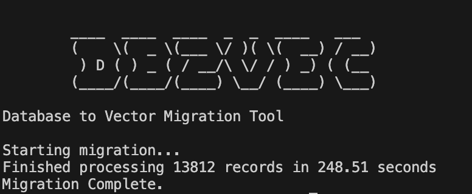

# db2vec: From Database Dumps to Vector Search at Speed 

[](https://opensource.org/licenses/MIT)

Tired of waiting hours for Python scripts to embed large database exports, especially on machines without powerful GPUs? So was I. Processing millions of records demands performance, even on standard hardware. `db2vec` is a high‑performance Rust tool designed for efficient **CPU-based embedding generation**. It parses your database dumps, generates vector embeddings using local models (Ollama, TEI) or cloud APIs (Google Gemini), and loads them into your vector database of choice – all optimized for speed without requiring a dedicated GPU.



---

## Core Features

*   🚀 **Blazing Fast:** Built in Rust for maximum throughput on large datasets, optimized for CPU.
*   🔄 **Parallel Processing:** Adjustable concurrency and batch‑size for embedding generation (`--num‑threads`, `--embedding‑concurrency`, `--embedding‑batch-size`).
*   📦 **Batch Inserts:** Configurable batch size (`-c, --chunk-size`) and payload limits (`-m, --max-payload-size-mb`) for efficient bulk loading into the target vector database.
*   🔧 **Highly Configurable:** Fine-tune performance and behavior with extensive CLI arguments for embedding, database connections, batching, and more.
*   📄 **Supported Dump Formats:**
    *   `.sql` (MySQL, PostgreSQL, MSSQL, SQLite, Oracle)
        *   **MSSQL:**
            ```bash
            sqlcmd -S server -U user -P pass -Q "SET NOCOUNT ON; SELECT * FROM dbo.TableName;" -o dump.sql
            ```
        *   *Oracle requires exporting via SQL Developer or similar into standard SQL.*
    *   `.surql` (SurrealDB)
*   🧠 **Flexible Embeddings:** Supports multiple providers:
    *   **Ollama** – best for local CPU/GPU, extremely fast.
    *   **TEI** – CPU-only Text Embeddings Inference (v1.7.0), slower than Ollama but faster than cloud. See [docs/TEI.md](docs/TEI.md) for details.
    *   **Google Gemini** – cloud API, ideal if you have very limited local resources. Beware of rate limits; use small batch sizes to avoid throttling.
*   💾 **Vector DB Targets:** Inserts vectors + metadata into:
    *   Chroma
    *   Milvus
    *   Pinecone (Cloud & Local Dev Image)
    *   Qdrant
    *   Redis Stack
    *   SurrealDB
*   ⚙️ **Pure Regex Parsing:** Fast, reliable record extraction (no AI).
*   🔒 **Authentication:** Supports user/password, API key, tenants/namespaces per DB.
*   ☁️ **Pinecone Cloud Support:** Automatically creates/describes indexes, uses namespaces.
*   🐞 **Debug Mode:** `--debug` prints parsed JSON records before embedding.

---

## Requirements

*   **Rust:** Latest stable (Edition 2021+).
*   **Embedding Provider:** One of the following configured:
    *   **Ollama:** Running locally with your desired model(s) pulled (e.g., `ollama pull nomic-embed-text`).
    *   **TEI:** Requires TEI binary (`tei-metal`) and compatible model (e.g., `nomic-embed-text-v2-moe`). See [docs/TEI.md](docs/TEI.md) for setup.
    *   **Google Gemini:** A valid Google Cloud API key (`--secret` or `EMBEDDING_API_KEY`) with the Generative Language API enabled for your project.
*   **Target DB:** One of Chroma, Milvus, Pinecone, Qdrant, Redis Stack, SurrealDB (Docker recommended for local).
*   **(Optional) `.env`:** For setting default configuration values.

---

## Configuration

Configuration can be set using CLI flags or by creating a `.env` file in the project root. CLI flags always override values set in the `.env` file.

Refer to the `.env-example` file for a comprehensive list of available environment variables, their descriptions, and default values.

---

## How It Works

1.  **Read & Detect:** Load dump (`.sql`/`.surql`), detect SQL dialect or SurrealDB.
2.  **Parse (Regex):** Extract records and types.
3.  **Embed:** Call the selected embedding provider (`ollama`, `tei` on CPU, `google`) to get vectors.
4.  **Auto-Schema:** Automatically create:
    *   Target database if it doesn't exist
    *   Collections/indices from table names in the dump
    *   Proper dimension settings based on your `--dimension` parameter
    *   Distance metrics using your specified `--metric` value
5.  **Store:** Insert into your vector DB with metadata.

---

## Automatic Collection Creation

For each table in your source data dump, `db2vec` automatically:

*   Creates a corresponding collection/index in the target vector database
*   Names the collection after the source table name
*   Configures proper dimensions and metric type based on your CLI arguments
*   Creates the database first if it doesn't exist

This zero-config schema creation means you don't need to manually set up your vector database structure before import.

> **Note:** When using Redis with `--group-redis`, collections aren't created in the traditional sense. Instead, records are grouped by table name into Redis data structures (e.g., `table:profile` → [records]). Without this flag, Redis stores each record as an individual entry with a table label in the metadata.
>
> **Warning:** If collections already exist, their dimension must match the `--dimension` parameter you provide. Some databases like Pinecone will reject vectors with mismatched dimensions, causing the import to fail.

---

## Quick Start

1.  **Clone & build**
    ```bash
    git clone https://github.com/DevsHero/db2vec.git
    cd db2vec
    cargo build --release
    ```
2.  **Prepare your dump**
    *   MySQL/Postgres/Oracle: export `.sql`
    *   MSSQL: `sqlcmd … > mssql_dump.sql`
    *   SQLite: `sqlite3 mydb.db .dump > sqlite_dump.sql`
    *   SurrealDB: `.surql` file
3.  **(Optional) Create `.env`:** Copy `.env-example` to `.env` and customize defaults.
4.  **Run**
    ```bash
    # MySQL → Milvus (using Ollama)
    ./target/release/db2vec \
      -f mysql_sample.sql \
      -t milvus \
      --host http://127.0.0.1:19530 \
      --database mydb \
      --embedding-provider ollama \
      --embedding-model nomic-embed-text \
      --dimension 768 \
      -u root -p secret --use-auth \
      --debug

    # SurrealDB → Pinecone (using TEI)
    ./target/release/db2vec \
      -f surreal_sample.surql \
      -t pinecone \
      --host https://index-123.svc.us-east-1.pinecone.io \
      --namespace myns \
      --embedding-provider tei \
      --tei-binary-path tei/tei-metal \
      --embedding-model nomic-embed-text-v2-moe \
      --dimension 768

    # SQLite → Qdrant (using Google Gemini)
    ./target/release/db2vec \
      -f sqlite_dump.sql \
      -t qdrant \
      --host http://localhost:6333 \
      --embedding-provider google \
      --embedding-model text-embedding-004 \
      --dimension 768 \
      --embedding-api-key <GOOGLE_API_KEY> \
      --dimension 768 \
      --debug
    ```

---

## Usage

```bash
# Cargo
cargo run -- [OPTIONS]

# Binary
./target/release/db2vec [OPTIONS]

# Logging
RUST_LOG=info ./target/release/db2vec [OPTIONS]
RUST_LOG=debug ./target/release/db2vec --debug [OPTIONS]
```

## Compatibility

See [docs/compatible.md](docs/compatible.md) for the full compatibility matrix of supported vector database versions and import file formats.


---

## Docker Setup

Run supported vector DBs locally via Docker – see [DOCKER_SETUP.md](docs/DOCKER_SETUP.md) for commands.


---

## Target Environment

Primarily developed and tested against Docker‑hosted or cloud vector databases via RESTful APIs. Ensure your target is reachable from where you run `db2vec`. **Designed to run efficiently even on standard CPU hardware.**

---

## Contributing

Issues, PRs, and feedback welcome!

---

## License

MIT – see [LICENSE](LICENSE).