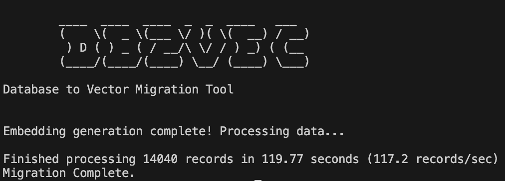

# db2vec: From Database Dumps to Vector Search at Speed

[](https://opensource.org/licenses/MIT)

Tired of waiting hours for Python scripts to embed large database exports? So was I. Processing millions of records demands performance that interpreted languages often struggle to deliver. That's why `db2vec` was born – a high‑performance Rust tool that parses your database dumps, generates vector embeddings via a local Ollama model (in parallel!), and loads them into your vector database of choice.



---

## Core Features

*   🚀 **Blazing Fast:** Built in Rust for maximum throughput on large datasets.
*   🔄 **Parallel Processing:** Adjustable concurrency and batch‑size for embedding generation (`--num‑threads`, `--embedding‑concurrency`, `--embedding‑batch-size`).
*   📦 **Batch Inserts:** Configurable batch size (`-c, --chunk-size`) and payload limits (`-m, --max-payload-size-mb`) for efficient bulk loading into the target vector database.
*   🔧 **Highly Configurable:** Fine-tune performance and behavior with extensive CLI arguments for embedding, database connections, batching, and more.
*   📄 **Supported Dump Formats:**
    *   `.sql` (MySQL, PostgreSQL, MSSQL, SQLite, Oracle)
        *   **MSSQL:**
            ```bash
            sqlcmd -S server -U user -P pass -Q "SET NOCOUNT ON; SELECT * FROM dbo.TableName;" -o dump.sql
            ```
        *   *Oracle requires exporting via SQL Developer or similar into standard SQL.*
    *   `.surql` (SurrealDB)
*   🧠 **Local Embeddings:** Uses Ollama (`--embedding-model`) to generate vectors.
*   💾 **Vector DB Targets:** Inserts vectors + metadata into:
    *   Chroma
    *   Milvus
    *   Pinecone (Cloud & Local Dev Image)
    *   Qdrant
    *   Redis Stack
    *   SurrealDB
*   ⚙️ **Pure Regex Parsing:** Fast, reliable record extraction (no AI).
*   🔒 **Authentication:** Supports user/password, API key, tenants/namespaces per DB.
*   ☁️ **Pinecone Cloud Support:** Automatically creates/describes indexes, uses namespaces.
*   🐞 **Debug Mode:** `--debug` prints parsed JSON records before embedding.

---

## Requirements

*   **Rust:** Latest stable (Edition 2021+).
*   **Ollama:** Running locally with your model(s):
    ```bash
    ollama pull nomic-embed-text        # 768‑dim (default)
    # ollama pull mxbai-embed-large     # 1024-dim
    # ollama pull all-minilm            # 384-dim
    ```
*   **Target DB:** One of Chroma, Milvus, Pinecone, Qdrant, Redis Stack, SurrealDB (Docker recommended for local).
*   **(Optional) `.env`:** For embedding URL/model and other defaults.

---

## Configuration

Use CLI flags or `.env` (CLI always wins).

```env
# File and database type options
FILE_PATH="./surreal.surql"
TYPE="redis"

# Authentication
USER="root"
PASS=""
SECRET="" # API Key for Chroma, Qdrant, Pinecone
AUTH="false"

# Connection details
HOST="redis://127.0.0.1:6379" # DB URL/Endpoint
DATABASE="default_database"   # DB Name (Chroma, Milvus, Qdrant, Surreal)
INDEXES="default_indexes"     # Pinecone Index Name
CLOUD="aws"                   # Pinecone Cloud Provider (aws, azure, gcp)
REGION="us-east-1"            # Pinecone Cloud Region
TENANT="default_tenant"       # Chroma Tenant
NAMESPACE="default_namespace" # SurrealDB/Pinecone Namespace

# Vector settings
DIMENSION=768
METRIC="cosine" # l2, ip, cosine, euclidean, dotproduct (Not all DBs support all)

# Batch processing options
PAYLOAD_SIZE_MB=12 # Max HTTP payload size for DB requests
CHUNK_SIZE=10      # Number of records per DB storage batch

# Embedding configuration
EMBEDDING_URL="http://localhost:11434"
EMBEDDING_MODEL="nomic-embed-text"
EMBEDDING_MAX_CONCURRENCY=4
EMBEDDING_BATCH_SIZE=16
EMBEDDING_MAX_TOKENS=8000
OLLAMA_TIMEOUT=60

# Performance settings
NUM_THREADS=0 # 0 = auto-detect CPU cores

# Special behaviors
DEBUG="false"
GROUP_REDIS="false" # Use Redis grouping vs individual keys
```

---

## Quick Start

1. **Clone & build**  
   ```bash
   git clone https://github.com/DevsHero/db2vec.git
   cd db2vec
   cargo build --release
   ```  
2. **Prepare your dump**  
   - MySQL/Postgres/Oracle: export `.sql`  
   - MSSQL: `sqlcmd … > mssql_dump.sql`  
   - SQLite: `sqlite3 mydb.db .dump > sqlite_dump.sql`  
   - SurrealDB: `.surql` file  
3. **Run**  
   ```bash
   # MySQL → Milvus
   ./target/release/db2vec \
     -f mysql_sample.sql \
     -t milvus \
     --host http://127.0.0.1:19530 \
     --database mydb \
     --dimension 768 \              # Must match nomic-embed-text's output dimension
     --embedding-model nomic-embed-text \
     -u root \
     -p secret \
     --use-auth \
     --debug

   # MSSQL → Pinecone
   ./target/release/db2vec \
     -f mssql_dump.sql \
     -t pinecone \
     --host <INDEX_HOST> \
     --namespace myns \
     --dimension 384 \              # Must match nomic-embed-text-384-v2's output dimension
     --embedding-model nomic-embed-text-384-v2 \
     --metric cosine \
     -k <API_KEY> \
     --use-auth

   # SQLite → Redis
   ./target/release/db2vec \
     -f sqlite_dump.sql \
     -t redis \
     --host redis://127.0.0.1:6379 \
     --group-redis  # Group records by table name
   ```

---

## Usage

```bash
# Cargo
cargo run -- [OPTIONS]

# Binary
./target/release/db2vec [OPTIONS]

# Logging
RUST_LOG=info ./target/release/db2vec [OPTIONS]
RUST_LOG=debug --debug
```

**Options:**

* `-f, --data-file <FILE>`           Path to the `.sql`/`.surql` dump [env: FILE_PATH, default: `./surreal.surql`]
* `-t, --db-export-type <TYPE>`      Target DB type: `redis|chroma|milvus|qdrant|surreal|pinecone` [env: TYPE, default: `redis`]
* `-u, --user <USER>`                Username for DB auth (Milvus, SurrealDB) [env: USER, default: `root`]
* `-p, --pass <PASS>`                Password for DB auth (Milvus, SurrealDB, Redis) [env: PASS, default: `""`]
* `-k, --secret <SECRET>`            API key / token (Chroma, Qdrant, Pinecone) [env: SECRET, default: `""`]
* `--use-auth`                       Enable authentication for the vector database [env: AUTH, default: `false`]
* `--debug`                          Enable debug mode (prints parsed JSON) [env: DEBUG, default: `false`]
* `--host <HOST>`                    DB URL / host endpoint.  
                                    – Redis: `redis://127.0.0.1:6379`  
                                    – Pinecone Cloud: full data‑plane URL (e.g. `https://index‑123.svc.us‑east‑1.pinecone.io`)  
                                    [env: HOST, default: `redis://127.0.0.1:6379`]
* `--database <DATABASE>`            Target database name (Chroma, Milvus, Qdrant, Surreal) [env: DATABASE, default: `default_database`]
* `--indexes <INDEXES>`              Pinecone index name (will be created/described on Cloud) [env: INDEXES, default: `default_indexes`]
* `--cloud <CLOUD>`                  Pinecone cloud provider: `aws|azure|gcp` [env: CLOUD, default: `aws`]
* `--region <REGION>`                Pinecone cloud region (e.g. `us-east-1`) [env: REGION, default: `us-east-1`]
* `--tenant <TENANT>`                Chroma multi-tenant name [env: TENANT, default: `default_tenant`]
* `--dimension <DIMENSION>`          Vector dimension size (must match embedding model) [env: DIMENSION, default: `768`]
* `--metric <METRIC>`                Distance metric: `l2|ip|cosine|euclidean|dotproduct` [env: METRIC, default: `cosine`]
* `-m, --max-payload-size-mb <MB>`   Max payload size in MB [env: PAYLOAD_SIZE_MB, default: `12`]
* `-c, --chunk-size <N>`             Number of records per batch insert [env: CHUNK_SIZE, default: `10`]
* `--embedding-model <MODEL>`        Ollama model name [env: EMBEDDING_MODEL, default: `nomic-embed-text`]
* `--embedding-url <URL>`            Ollama API endpoint [env: EMBEDDING_URL, default: `http://localhost:11434`]
* `--embedding-max-concurrency <N>`  Parallel embedding requests [env: EMBEDDING_MAX_CONCURRENCY, default: `4`]
* `--embedding-batch-size <N>`       Texts per embedding batch [env: EMBEDDING_BATCH_SIZE, default: `16`]
* `--embedding-max-tokens <N>`       Max tokens per embedding request [env: EMBEDDING_MAX_TOKENS, default: `8000`]
* `--embedding-timeout <SEC>`        Embedding timeout in seconds [env: OLLAMA_TIMEOUT, default: `60`]
* `--num-threads <N>`                CPU threads (0=auto‑detect) [env: NUM_THREADS, default: `0`]
* `--group-redis`                    Group Redis records by table name (vs individual keys) [env: GROUP_REDIS, default: `false`]

---

## Pinecone Cloud Support

When `-t pinecone` is selected and `--host` is not a local URL:

1.  **Create / Describe Index**  
    - Uses the control plane `https://api.pinecone.io/indexes`  
    - Requires `--indexes`, `--secret` (API key), `--cloud`, and `--region`  
    - If the index does not exist, it is created with your `--dimension` and `--metric`  
    - On `409 Conflict`, the existing index is described to retrieve its data‑plane host  

2.  **Data‑Plane Upserts**  
    - Vectors are upserted to `https://<your-index-host>`  
    - Namespace = source table name (each table is a separate namespace)  
    - Metadata includes a `"table": "<table_name>"` field  

> **Note:** For local Pinecone dev images, index creation via API may not be supported.  
> Ensure your index exists or provide the full data‑plane URL with `--host`.

---

## Docker Setup

Run supported vector DBs locally via Docker – see [DOCKER_SETUP.md](DOCKER_SETUP.md) for commands.

---

## How It Works

1. **Read & Detect:** Load dump (`.sql`/`.surql`), detect SQL dialect or SurrealDB.  
2. **Parse (Regex):** Extract records and types.  
3. **Embed:** Call Ollama with `EMBEDDING_MODEL` to get vectors.  
4. **Auto-Schema:** Automatically create:
   - Target database if it doesn't exist 
   - Collections/indices from table names in the dump
   - Proper dimension settings based on your `--dimension` parameter
   - Distance metrics using your specified `--metric` value
5. **Store:** Insert into your vector DB with metadata.

---

## Automatic Collection Creation

For each table in your source data dump, `db2vec` automatically:

* Creates a corresponding collection/index in the target vector database
* Names the collection after the source table name
* Configures proper dimensions and metric type based on your CLI arguments
* Creates the database first if it doesn't exist

This zero-config schema creation means you don't need to manually set up your vector database structure before import.

> **Note:** When using Redis with `--group-redis`, collections aren't created in the traditional sense. Instead, records are grouped by table name into Redis data structures (e.g., `table:profile` → [records]). Without this flag, Redis stores each record as an individual entry with a table label in the metadata.
> 
> **Warning:** If collections already exist, their dimension must match the `--dimension` parameter you provide. Some databases like Pinecone will reject vectors with mismatched dimensions, causing the import to fail.

---

## Target Environment

Primarily developed and tested against Docker‑hosted or cloud vector databases via RESTful APIs. Ensure your target is reachable from where you run `db2vec`.

---

## Contributing

Issues, PRs, and feedback welcome!

---

## License

MIT – see [LICENSE](LICENSE).